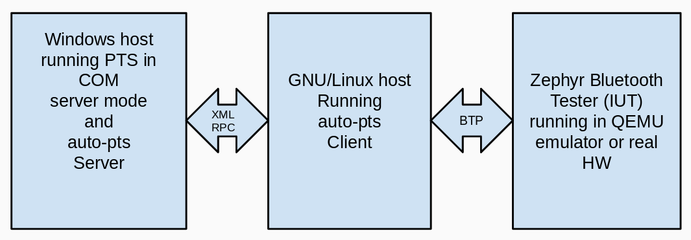

# Table of Contents

   * [Introduction](#introduction)
   * [Architecture](#architecture)
   * [Windows Prerequisites](#windows-prerequisites)
   * [Generating Interop Assembly](#generating-interop-assembly)
   * [PTS Workspace Setup](#pts-workspace-setup)
   * [Running in Client/Server Mode](#running-in-clientserver-mode)
   * [Running Test Script on Windows](#running-test-script-on-windows)
   * [Running AutoPTSClientBot](#running-autoptsclientbot)
   * [IRC Channel on freenode.net](#irc-channel-on-freenodenet)

# Introduction

The Bluetooth Profile Tuning Suite (PTS) is a Bluetooth testing tool provided by Bluetooth SIG. The PTS is a Windows program that is normally used in manual mode via its GUI

auto-pts is the Bluetooth PTS automation framework. auto-pts uses PTSControl COM API of PTS to automate testing.

Over 460 test cases have been automated for Zephyr OS which reduced testing time from one man-month to 9 hours. auto-pts has been used to automate testing of two Bluetooth stacks thus far:

* BlueZ
* Zephyr BLE

# Architecture

**auto-pts server**: runs on Windows and provides over-the-network XML-RPC interface to PTS. It is implemented in Python and executed using Python 3.6

**auto-pts client**: runs on GNU/Linux, communicates with the auto-pts server (to start/stop test cases, to send response to PTS inquiries) and communicates with the Implementation Under Test to take appropriate actions. It is implemented in Python and executed using CPython.

**Implementation Under Test (IUT)**: It is the host running Bluetooth stack to be tested, this could be an emulator or real hardware. The IUT is controlled by using Bluetooth Test Protocol.

**Bluetooth Test Protocol (BTP)**: Used to communicate with the IUT. See `doc/btp_spec.txt`

# Linux Prerequisites

Install required modules with:

`python2 -m pip install --user -r autoptsclient_requirements.txt`

# Windows Prerequisites

To be able to run PTS in automation mode, there should be no PTS instances running in the GUI mode. Hence, before running these scripts close the PTS GUI.

Install required modules with:

`python.exe -m pip install --user -r autoptsserver_requirements.txt`

# PTS Workspace Setup

Before running any scripts you have to create a workspace in the PTS, add needed projects to the workspace and configure PICs and PIXITs.

Alternatively, you can use auto-pts workspaces. Auto-pts provides ready PTS workspaces with readily configured PICS in the "workspaces" directory. Currently it provides workspaces for the Zephyr HCI stack. To select ready made workspace pass to the auto-pts client as the workspace argument:

  * zephyr-hci

# Running in Client/Server Mode

The auto-pts framework uses a client server architecture. With this setup the PTS automation server runs on Windows and the client runs on GNU/Linux. So on Windows you start the server:

`python.exe autoptsserver.py`

And on GNU/Linux you select either the AOSP BlueZ, Zephyr or BlueZ client, then pass it the IP address of the server and the path to the PTS workspace file on the Windows machine. So for AOSP BlueZ projects:

`./autoptsclient-aospbluez.py "C:\Users\USER_NAME\Documents\Profile Tuning Suite\PTS_PROJECT\PTS_PROJECT.pqw6" -i IP_ADDRESS`

For Zephyr projects running under QEMU:

Start a proxy for Bluetooth adapter by using btproxy from BlueZ:

`sudo bluez/tools/btproxy -u -z`

Then start the client:

`./autoptsclient-zephyr.py "C:\Users\USER_NAME\Documents\Profile Tuning Suite\PTS_PROJECT\PTS_PROJECT.pqw6" zephyr.elf -i IP_ADDRESS`

Zephyr running in Arduino:

`./autoptsclient-zephyr.py "C:\Users\USER_NAME\Documents\Profile Tuning Suite\PTS_PROJECT\PTS_PROJECT.pqw6" -i IP_ADDRESS zephyr.elf -t /dev/ttyUSB0 -b arduino_101 -d`

The command to run auto-pts client using auto-pts Zephyr HCI workspace is:

`./autoptsclient-zephyr.py zephyr-hci zephyr.elf -i IP_ADDRESS -t /dev/ttyUSB0 -b arduino_101 -d`

# Running Test Script on Windows

It is also possible to run tests on Windows, without using client/server mode of auto-pts. On Windows instead of starting the auto-pts server start test script as:

`ipy.exe autopts.py`

autopts.py has been used to test AOSP BlueZ Bluetooth stack, and serves a good reference on how to create a tester for Windows.

# Running AutoPTSClientBot

AutoPTSClientBot has been added to automate running test cases on various
configurations and reporting the results.
Initial bot implementation supports running Zephyr tests on nrf52 board.

**Key features**

- Scheduler to run the script periodically
- Fetching recent project sources
- Applying changes to project configuration files via "iut_config"
with "overlay" that need to be applied for "test_cases"
- Building ZephyrOS image
- Flashing board
- Running all the test cases
- Archiving test execution logs
- Storing the results in Excel spreadsheet file
    - test case statuses
    - pie chart
- Sending the files to the Google Drive
- Sending e-mail

**Configuration**

Bot is configured via "bot/config.py" file. Sample `bot/config.py.sample` file
is provided. The configuration file is composed of project configurations.
This may contain few sections:
- 'name' - AutoPTS project name
- 'auto_pts' - AutoPTS configuration
    - 'server_ip' - AutoPTSServer IP address
    - 'client_port' - local AutoPTSClient port
    - 'project_path' - path to project source directory
    - 'workspace' - PTS workspace path to be used
    - 'board' - IUT used. Currently nrf52 is supported only
    - 'enable_max_logs' - enable debug logs
    - 'retry' - maximum repeat count per test
    - 'bd_addr' - IUT Bluetooth Address (optional)
- 'mail' - Mail configuration (optional)
    - 'sender' - sender e-mail address
    - 'smtp_host', 'smtp_port' - sender SMTP configuration
    - 'name' - to be used in message footer
    - 'passwd' - sender mailbox password. When Google account is used [allow
    less secure apps to access account](https://myaccount.google.com/lesssecureapps)
    - 'recipients' - list of e-mail addresses
- 'gdrive' - GDrive configuration (optional)
    - 'root_directory_id' - Root Directory ID, can be obtained from URL,
    `https://drive.google.com/drive/u/0/folders/<GoogleDriveDirID>`
    - 'credentials_file' - path to credentials file to access Google Account.
    Read more [here](https://developers.google.com/drive/v3/web/quickstart/python).
- 'iut_config' - IUT configuration overlay. This is used to apply test case
specific changes in IUT configuration. It consists of dict of configuration
names and related key: value pairs:
    - 'overlay' - changes in config to be applied
    - 'test_cases' - test cases to be ran with this config
- 'scheduler' - Scheduler configuration (optional)
    - "weekday": "time" dictionary.

**Installation**

Install required Python modules (
schedule,
gitpython,
xlsxwriter,
google-api-python-client
) with:

    cd ~/auto-pts  # or to your directory where AutoPTS is cloned
    pip2 install --user -r bot/requirements.txt

**Usage**

    cd ~/auto-pts  # or to your directory where AutoPTS is cloned
    ./autoptsclient_bot.py

# IRC Channel on freenode.net

Our IRC channel on freenode.net is #autopts
