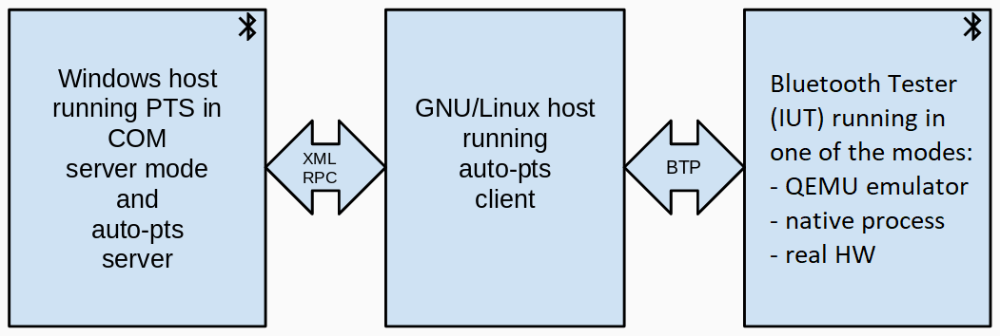
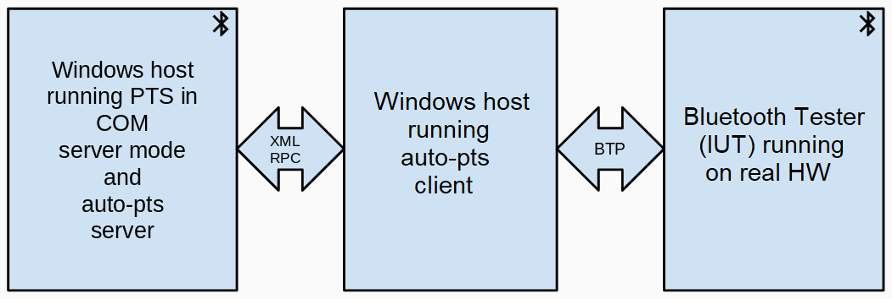

# Table of Contents

   * [Introduction](#introduction)
   * [Architecture](#architecture)
   * [Linux Prerequisites](#linux-prerequisites)
   * [Windows Prerequisites](#windows-prerequisites)
   * [PTS Workspace Setup](#pts-workspace-setup)
   * [Running in Client/Server Mode](#running-in-clientserver-mode)
   * [Running AutoPTSClientBot](#running-autoptsclientbot)
   * [Zephyr with AutoPTS step-by-step setup tutorial](#zephyr-with-autopts-step-by-step-setup-tutorial)
   * [More examples of run and tips](#more-examples-of-run-and-tips)
   * [Slack Channel](#slack-channel)

# Introduction

The Bluetooth Profile Tuning Suite (PTS) is a Bluetooth testing tool provided by Bluetooth SIG. The PTS is a Windows program that is normally used in manual mode via its GUI.

auto-pts is the Bluetooth PTS automation framework. auto-pts uses PTSControl COM API of PTS to automate testing.

Over 630 test cases have been automated for Zephyr OS and Mynewt OS which reduced testing time from 'one man - 2 months' to 15 hours. auto-pts has been used to automate testing of three Bluetooth stacks thus far:

* BlueZ
* Zephyr BLE
* Mynewt NimBLE

# Architecture

2 setups are available:

### Linux + Windows



### Windows




**auto-pts server**: Implemented in Python 3. Runs on Windows and provides over-the-network XML-RPC interface to PTS.

**auto-pts client**: Implemented in Python 3. Runs on GNU/Linux or Windows, communicates with the auto-pts server (to start/stop test cases, to send response to PTS inquiries) and communicates with the Implementation Under Test to take appropriate actions.

**Implementation Under Test (IUT)**: It is the host running Bluetooth stack to be tested, this could be an emulator or real hardware. The IUT is controlled by using Bluetooth Test Protocol.

**Bluetooth Test Protocol (BTP)**: Used to communicate with the IUT. See `doc/btp_spec.txt`

# Linux Prerequisites

For auto-pts client under Linux:

1. `socat` that is used to transfer BTP data stream from UART's tty file.

        sudo apt-get install python-setuptools socat

2. Additionally, install required Python modules with:

        python3 -m pip install --user -r autoptsclient_requirements.txt

The rest of the setup is platform/mode specific:

### BlueZ

See [ptsprojects/bluez/README.md](autopts/ptsprojects/bluez/README.md)

### Zephyr BLE

See [Zephyr with AutoPTS step-by-step setup tutorial](#zephyr-with-autopts-step-by-step-setup-tutorial)

### Mynewt NimBLE

Perform setup from [Apache MyNewt](https://mynewt.apache.org/latest/get_started/index.html), typically:

1. [Install Newt](https://mynewt.apache.org/latest/newt/install/newt_linux.html)
2. [Instal toolchain and J-Link](https://mynewt.apache.org/latest/get_started/native_install/cross_tools.html)
3. Test setup with [Blinky project](https://mynewt.apache.org/latest/tutorials/blinky/nRF52.html)

# Windows Prerequisites

For auto-pts server:

To be able to run PTS in automation mode, there should be no PTS instances running in the GUI mode. Hence, before running these scripts close the PTS GUI.

1. Install required modules with:

        python.exe -m pip install --user -r autoptsserver_requirements.txt

For auto-pts client:

1. Install required modules with:

        python.exe -m pip install --user -r autoptsclient_requirements.txt

2. Download socat.exe from https://sourceforge.net/projects/unix-utils/files/socat/1.7.3.2/ and add to PATH socat.exe directory.

The rest of the auto-pts client setup is platform/mode specific:

### Zephyr BLE

Check out [Zephyr with AutoPTS step-by-step setup tutorial](#zephyr-with-autopts-step-by-step-setup-tutorial)

### MyNewt NimBle

For building and flashing app image Newt tool is required. On Windows it should
be installed as MSYS2 application.

In MSYS2 MinGW x64 application:
1. Install [MSYS2/MinGW](https://www.msys2.org) from installer and run
    ```shell
    $ pacman -Syu
    $ pacman -Su
    ```
2. Install Git
    ```shell
    $ pacman -S git
    ```
3. Install Go
   ```shell
   $ pacman -S mingw-w64-x86_64-go
   ```
   If this command fails with error like:
   ```shell
   File /var/cache/pacman/pkg/mingw-w64-x86_64-libpng-1.6.12-1-any.pkg.tar.xz is corrupted (invalid or corrupted package (PGP signature)).
   ```
   keys need to be updated:
   ```shell
   $ pacman-key --init
   $ pacman-key --populate msys2
   $ pacman-key --refresh-keys
   ```
4. Install Newt tool. For testing Mynewt from master branch we often require
   in-dev versions of Newt tool, from master branch. To install just latest
   release:
   ```shell
   $ wget -P /tmp https://github.com/apache/mynewt-newt/archive/mynewt_1_8_0_tag.tar.gz
   $ tar -xzf /tmp/mynewt_1_8_0_tag.tar.gz
   $ cd mynewt-newt-mynewt_1_8_0_tag/mynewt-newt/newt
   $ go get
   $ go build
   $ /home/user_name/mynewt-newt/newt/newt.exe
   ```
   To install Newt in-dev version:
   ```shell
   $ git clone https://github.com/apache/mynewt-newt.git
   $ cd mynewt-newt/newt
   $ go get
   $ go build
   $ mv /home/user_name/mynewt-newt/newt/newt.exe /usr/bin
   ```
   You can verify installation by calling `newt version`
5. To install cross-compilation tools follow [this](https://github.com/apache/mynewt-documentation/blob/master/docs/get_started/native_install/cross_tools.rst)
   guide
6. Setup Mynewt Project using [this](https://github.com/apache/mynewt-documentation/blob/master/docs/get_started/project_create.rst)
   guide
7. Python functions must use environment we just setup, so functions calling
   shell commands like `check_call` must use MSYS. In Windows we must setup
   environment variable to specify this.
   1. open Environment Variables settings by pressing <kbd>⊞ Win</kbd>+<kbd>R</kbd>
      and typing `systempropertiesadvanced`.
   2. Click “Environment Variables” button
   3. In “Environment Variables” click `New`
   4. As `Variable Name` set `MSYS2_BASH_PATH`
   5. As `Variable Value` set `C:\msys64\usr\bin\bash.exe`

# PTS Workspace Setup

Before running any scripts you have to create a workspace in the PTS, add needed projects to the workspace and configure PICs and PIXITs.

Alternatively, you can use auto-pts workspaces. Auto-pts provides ready PTS workspaces with readily configured PICS in the "workspaces" directory. The list of available workspaces:

  * bluez
  * Mynewt Nimble Host
  * zephyr-master
  * zephyr-v1.14
  * zephyr-v2.2.0

# Running in Client/Server Mode

The auto-pts framework uses a client server architecture. With this setup the PTS automation server runs on Windows and the client runs on GNU/Linux.

The command below starts AutoPTS server on Windows:

    python.exe autoptsserver.py

There are separate `autoptsclient-*.py` scripts to lunch AutoPTS Client depending on the tested stack.

**Testing Zephyr Host Stack on QEMU**

Start a proxy for Bluetooth adapter by using `btproxy` tool from BlueZ:

    sudo bluez/tools/btproxy -u -z

Then start the AutoPTS Client using e.g. own workspace file:

    ./autoptsclient-zephyr.py "C:\Users\USER_NAME\Documents\Profile Tuning Suite\PTS_PROJECT\PTS_PROJECT.pqw6" zephyr.elf -i SERVER_IP -l LOCAL_IP

**Testing Zephyr combined (controller + host) build on nRF52**:

    ./autoptsclient-zephyr.py zephyr-master -i SERVER_IP -l LOCAL_IP -t /dev/ttyACM0 -b nrf52

**Testing Zephyr Host Stack on native posix**:

    ./autoptsclient-zephyr.py zephyr-master <path>/zephyr.exe -i SERVER_IP -l LOCAL_IP --hci 0

**Testing Mynewt build on nRF52**:

    ./autoptsclient-mynewt.py "Mynewt Nimble Host" -i SERVER_IP -l LOCAL_IP -t /dev/ttyACM0 -b nordic_pca10056

**Testing BlueZ on Linux**:

See [ptsprojects/bluez/README.md](autopts/ptsprojects/bluez/README.md)

# Running AutoPTSClientBot

AutoPTSClientBot has been added to automate running test cases on various
configurations and reporting the results.

**Key features**

- Fetching recent project sources
- Applying changes to project configuration files via "iut_config"
with "overlay" that need to be applied for "test_cases"
- Building ZephyrOS/MynewtOS image
- Flashing board
- Running all the test cases
- Archiving test execution logs
- Storing the results in Excel spreadsheet file
    - test case statuses
    - pie chart
- Sending the files to the Google Drive
- Sending e-mail

**Configuration**

The Bot configuration file is located in `bot` . Sample files `bot/config.py.zephyr.sample`
and `bot/config.py.mynewt.sample` are provided. The file contains setup and project-specific configuration.

This may contain few sections:
- `name` - AutoPTS project name
* `auto_pts` - AutoPTS configuration
    - `client_ip` - AutoPTSClient IP address/es
    - `server_ip` - AutoPTSServer IP address/es
    - `cli_port` - AutoPTSClient port(s)
    - `srv_port` - AutoPTSServer port(s)
    - `project_path` - path to project source directory
    - `workspace` - PTS workspace path to be used
    - `store` - set True to save run results in a database .db file (default False)
    - `database_file` - custom path to database .db file (default path: <project-dir>/TestCase.db)
    - `board` - IUT used. Currently nrf52 is supported only
    - `enable_max_logs` - enable debug logs
    - `retry` - maximum repeat count per test
    - `stress test` - repeat every test `retry` number of times, even if result was PASS
    - `bd_addr` - IUT Bluetooth Address (optional)
    - `recovery` - enable recovery after non-valid result (optional)
    - `superguard` - force recovery when server has been idle for the given time (optional)
    - `ykush` - reconnect board/PTS dongle during recovery, if YKUSH Switchable Hub is used (optional)
    - `rtt_log` - collect IUT logs via RTT J-Link buffer named "Logger"
    - `btmon` - collect IUT btsnoops with btmon
- `git` - Git repositories configuration (optional)
    - `path` - path to project repo
    - `remote` - git remote repo name
    - `branch` - branch selected at git checkout
    - `stash_changes` - stash changes if local repo is dirty
    - `update_repo` - if False, prevents bot from updating the repo
- `mail` - Mail configuration (optional)
    - `sender` - sender e-mail address
    - `smtp_host`, `smtp_port` - sender SMTP configuration
    - `subject` - overrides default email title
    - `name` - to be used in message footer
    - `passwd` - sender mailbox password. When Google account is used [allow
    less secure apps to access account](https://myaccount.google.com/lesssecureapps)
    - `recipients` - list of e-mail addresses
    - `start_tls` - put SMTP server into TLS mode
* `gdrive` - GDrive configuration (optional)
    - `root_directory_id` - Root Directory ID, can be obtained from URL,
    `https://drive.google.com/drive/u/0/folders/<GoogleDriveDirID>`
    - `credentials_file` - path to credentials file to access Google Account.
    Read more [here](https://developers.google.com/drive/v3/web/quickstart/python).
- `iut_config` - IUT configuration overlay. This is used to apply test case
specific changes in IUT configuration. It consists of dict of configuration
names and related key: value pairs:
    - `overlay` - changes in config to be applied
    - `test_cases` - test cases to be ran with this config
* `scheduler` - Scheduler configuration (optional)
    - `weekday`: "time" dictionary.

**Installation**

Install required Python modules with:

    pip3 install --user -r bot/requirements.txt

**Usage**

    ./autoptsclient_bot.py

# Zephyr with AutoPTS step-by-step setup tutorial
Check out the guide how to set up AutoPTS for Zephyr + nRF52 under:
- Linux + Windows 10 virtual machine

  https://docs.zephyrproject.org/latest/connectivity/bluetooth/autopts/autopts-linux.html

- Windows 10

  https://docs.zephyrproject.org/latest/connectivity/bluetooth/autopts/autopts-win10.html

# More examples of run and tips

**Run many instances of autoptsserver on one Windows**

Run in first console:

    $ python autoptsserver.py

and in second console:

    $ python autoptsserver.py -S 65002

or both in one console

    $ python autoptsserver.py -S 65000 65002

**Run many autoptsclient-zephyr.py instances on one machine**

Under Windows, run in first console: (-S 65000 -C 65001 by default)

    $ python ./autoptsclient-zephyr.py zephyr-master -t COM3 -b nrf52

and in second console:

    $ python ./autoptsclient-zephyr.py zephyr-master -t COM4 -b nrf52 -S 65002 -C 65003

and more. Note that IP 127.0.0.1 is default, so there is no need to specify with -i and -l options.

Under Linux, run in first console: (-S 65000 -C 65001 by default)

    $ ./autoptsclient-zephyr.py zephyr-master -i 192.168.4.2 192.168.4.2 -l 192.168.4.1 192.168.4.1 -t /dev/ttyACM0 -b nrf52

in second console:

    $ ./autoptsclient-zephyr.py zephyr-master -i 192.168.4.2 192.168.4.2 -l 192.168.4.1 192.168.4.1 -t /dev/ttyACM1 -b nrf52 -S 65002 -C 65003

**Example run of autoptsclient-zephyr for MESH testing:**

In some test cases 2 instances of PTS are needed. So run autoptsserver with 2 instances:

    $ python autoptsserver.py -S 65000 65002

Under Windows, run in second console:

    $ python ./autoptsclient-zephyr.py zephyr-master -t COM3 -b nrf52 -c MESH -S 65000 65002 -C 65001 65003

Under Linux, run in one console:

    $ ./autoptsclient-zephyr.py zephyr-master -i 192.168.4.2 192.168.4.2 -l 192.168.4.1 192.168.4.1 -t /dev/ttyACM0 -b nrf52 -c MESH -S 65000 65002 -C 65001 65003

#### Recovery tips

This feature was created to enable long runs of bot without supervision, because in continuous development some regressions on IUT or PTS side sometimes loop a test case somewhere.

**Recover autoptsserver after exception**

Autoptsserver can recover itself after python exception or after request received from autoptsclient.
If you have YKUSH hub, you can run server with option --ykush, so recovery steps will include re-plugin of PTS dongles:

    $ python autoptsserver.py -S 65000 65002 --ykush 1 2

where 1 and 2 are numbers of YKUSH USB ports (More about [YKUSH hub](https://www.yepkit.com/products/ykush)).

Helpful --superguard option will blindly trigger recovery after given amount of time in minutes:

    $ python autoptsserver.py -S 65000 65002 --superguard 15

**Recover autoptsclient after exception**

Recovery of autoptsclient can be enabled with --recovery option and is triggered after python exception or test case result other than PASS, INCONC or FAIL.
Then it sends recovery request to autoptsserver, restarting and reinitializing PTSes.

    $ python ./autoptsclient-zephyr.py zephyr-master -t COM3 -b nrf52 --recovery

Options --superguard and --ykush works on autoptsclient same as on autoptsserver. So when run with --superguard 15, after 15 minutes of unfinished test case, superguard will force recovery. With option --ykush \<port\> the IUT board will be re-plugged during recovery.

# Slack Channel 

First join [Zephyr Slack Workspace](https://join.slack.com/t/zephyrproject/shared_invite/zt-953wf991-q7qw_houhNJrwT~Ac1TJEg)
Then join our Channel `#auto-pts`

Or join using direct link [auto-pts](https://zephyrproject.slack.com/archives/CG1N5KGUT)

