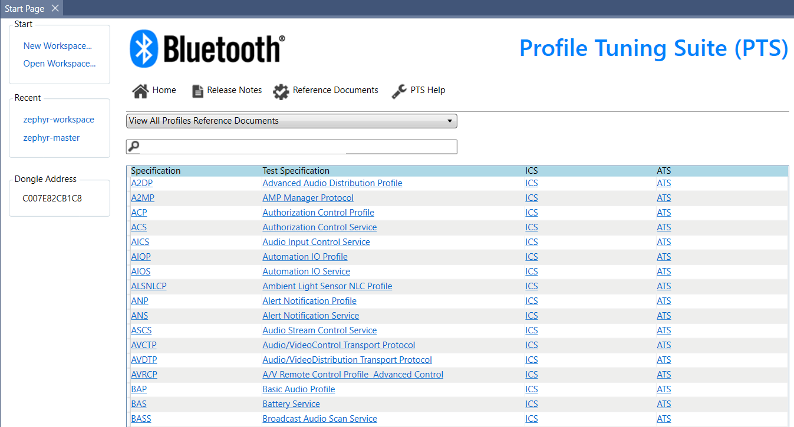
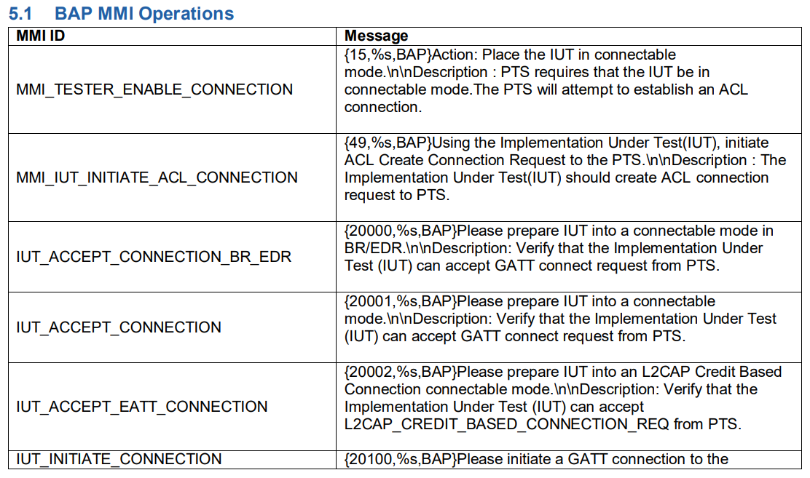

# Add support for a PTS profile

- [Plan the BTP interface](#plan-the-btp-interface)
- [Get familiar with tools](#get-familiar-with-tools)
- [Add a new profile](#add-a-new-profile)
- [Add a new test case](#add-a-new-test-case)
- [Synchronize multiple Lower Testers](#synchronize-multiple-lower-testers)
- [Keep global variables in Stack](#keep-global-variables-in-stack)

## Plan the BTP interface

PTS running in automation mode sends MMI requests to AutoPTS which handles them
by using [BTP protocol](../../doc/overview.txt). Each PTS profile has its own
set of MMI messages that can be found in ATS files. The links to ATS files can
be accessed in PTS GUI -> Start Page -> Reference Documents.



Reviewing MMI messages of a profile allows to gain a bigger picture of how the BTP
interface for that profile should be designed.



Planning the BTP interface before starting the implementation process will:
- avoid IUT specific implementation,
- make the BTP interface more generic in terms of reusing across multiple
profiles, reducing the amount of code on the IUT tester side,
- reduce the number of frequent BTP changes, so multiple projects could enjoy
the AutoPTS without disturbing their Bluetooth product development process.

Adding support for all test cases of a profile at once should result with
a complete BTP interface for the profile. If a partial BTP interface is
being contributed, with a few BTP commands, then those commands should be
well-thought-out so that they will not need to be updated in the future to
complete the remaining test cases.

Changing the parameters of a BTP command/response/event that has been used
for a while is difficult, because it might already have been adopted by many
and the change may rise objections. Adding a new helper command to the completed
BTP interfaces is more acceptable as it does not affect the existing IUT tester
implementations.

## Get familiar with tools

There are few log sources that will be helpful:

- PTS and Bluetooth Protocol Viewer logs,
- AutoPTS client and server logs,
- Jlink RTT logs,
- Btmon logs,
- Ellisys logs.

### PTS and Bluetooth Protocol Viewer logs

The logs allow to peek what happens on the Host side of the PTS dongle during
a test case.

AutoPTS saves the logs in the directory of the PTS workspace (the .pqw6 file).
Inside a test case sub folder there should be 4 files:
- `.xml` - PTS debug logs. Useful to find out what was the reason of a test case
failure when a problem was related to some failing checks in case some test case
conditions were not met.
- `.cfa`, `.frm` and `.fsc` - can be open only with BPV. They allow you to view
parsed packets exchanged between the host and the controller of the PTS dongle.

### AutoPTS client and server logs

The logs allow to peek what happens on the AutoPTS client or server side:
- what MMI are requested by PTS,
- what response to MMI is sent back to PTS,
- all data and order of the BTP communication,
- AutoPTS framework python exceptions, including missing MMI/WID handlers,
WID implementation bugs, bot features exceptions.

AutoPTS creates a log file named after the autopts client launcher that is used
e.g. `autoptsclient_zephyr_65000.log`, `autoptsclient_bot_65000_65002.log`,
`autoptsserver_65000_65002.log`... These log files contains AutoPTS client logs
from all test cases in the run. For convenience, the client logs are saved one
file per test case too in the `logs/` folder.

### Jlink RTT logs

If an IUT board supports debug logs sent via Jlink RTT logs, AutoPTS can read
them during a test case and save them in the `logs/` folder.

### Btmon logs

If an IUT supports btmon logs, AutoPTS can read them during a test case and
save them in the `logs/` folder in a btsnoop or plain text format.

### Ellisys logs.

If you are lucky user of [Ellisys sniffer](https://www.ellisys.com/better_analysis/bta_previous.php)
you will be able to resolve the tricky cases, where a controller is at fault.


## Add a new profile

To add a new profile to the AutoPTS, we have to start with some boilerplate code.
This can be done with the `./tools/generate_profile.py` generator. An example usage
that creates profile named PROFILE for the `zephyr` project:
```shell
$ python ./tools/generate_profile.py
Enter project name: zephyr
Enter profile name: profile
Enter new BTP service ID (max 255): 26
```

The generator creates all required new files and appends some additional imports
and entries to the existing ones to tie everything together. Let's do a quick
overview of what the generated files and entries are for:

### `doc/btp_profile.txt`

This file is for a description of the profile BTP interface.

### `autopts/pybtp/btp/profile.py`

This file is for implementations of the BTP interface, i.e. functions
for packing the BTP commands, and parsers of the BTP events and responses.

### `autopts/pybtp/defs.py`

New BTP service interface needs an ID, so create a new entry `BTP_SERVICE_ID_PROFILE = 26`
inside the `autopts/pybtp/defs.py`, where the value should be the next available ID value.
Keep all BTP interface opcodes inside the file, i.e. all the BTP commands and events opcodes.

### `autopts/wid/profile.py`

This file is for MMI/WID handlers of the profile, generic for all projects. The handlers
make use of the BTP commands, responses and events. If there is a need for a project specific
handler, then it should be added into the `autopts/ptsprojects/zephyr/profile_wid.py` inside
the project.

### `autopts/ptsprojects/stack/layers/profile.py`

The `class Stack` is a good place for global variables that have to be shared
between MMI/WID handlers, because the Stack instance is reinitialized before 
start of each test case. So create a class like `class Profile` and make it a part
of the Stack.

### `autopts/ptsprojects/zephyr/profile.py`

This file has to contain two functions:
`def set_pixits(ptses)` and `def test_cases(ptses)`.

The `def set_pixits(ptses)` configures how AutoPTS should overwrite the default
PIXITs value of a PTS workspace. The function could be as short as:

```python
def set_pixits(ptses):
    pts = ptses[0]

    pts.set_pixit("BAP", "TSPX_time_guard", "180000")
    pts.set_pixit("BAP", "TSPX_use_implicit_send", "TRUE")

    if len(ptses) < 2:
        return

    pts2 = ptses[1]
    pts2.set_pixit("BAP", "TSPX_time_guard", "180000")
    pts2.set_pixit("BAP", "TSPX_use_implicit_send", "TRUE")
```

The `def test_cases(ptses)` is used to customize the IUT configuration and behavior
before and after running test cases of the profile. A short version of the function
could look like this:

```python
def test_cases(ptses):
    """Returns a list of PROFILE test cases
    ptses -- list of PyPTS instances"""

    pts = ptses[0]
    stack = get_stack()

    # Generic preconditions for all test case in the profile
    pre_conditions = [
        TestFunc(btp.core_reg_svc_profile),
        TestFunc(stack.profile_init)
    ]

    test_case_name_list = pts.get_test_case_list('PROFILE')
    tc_list = []

    # Use the same preconditions and MMI/WID handler for all test cases of the profile 
    for tc_name in test_case_name_list:
        instance = ZTestCase('PROFILE', tc_name, cmds=pre_conditions,
                             generic_wid_hdl=profile_wid_hdl)

        tc_list.append(instance)

    return tc_list
```

In almost every profile there are multiple test cases that need a custom preconditions,
e.g. at the start of a test case PTS expects a specific advertisement
in the air, but there is no MMI (WID) for it. Test cases with multiple Lower Testers
(PTS instances) usually need to be synchronized with Synch Points to avoid collision
of BTP commands, so those can be customized here too.

The `profile_wid_hdl` parameter of the TestCase class is a generic handler that
will find a right handler for an MMI (WID) request received from Lower Tester
(PTS instance). In most test cases a project will use handlers only from
`autopts/wid`, but sometimes a custom, project-specific WID is required.
It is convenient to create a separate file in your project for this, e.g:
`autopts/ptsprojects/zephyr/profile_wid.py`:

```python
# profile_wid.py file
import logging

from autopts.wid import generic_wid_hdl
from autopts.pybtp.types import WIDParams

log = logging.debug


def profile_wid_hdl(wid, description, test_case_name):
    log(f'{profile_wid_hdl.__name__}, {wid}, {description}, {test_case_name}')

    # Try to find the WID handler in this file, if not found then proceed to
    # the generic autopts/wid/profile.py.
    return generic_wid_hdl(wid, description, test_case_name,
                           [__name__, 'autopts.wid.profile'])


def hdl_wid_104(_: WIDParams):
    """
    Confirm if the Lower Tester received ISO stream.
    """
    # Should be handled by the Lower Tester, errata in progress.

    return True
```

## Add a new test case

Assuming you have completed the setup of the profile, you are ready to
start implementing BTP interface and missing MMI/WID handlers for a test case.

Depending on the role the IUT is given in the test case, the IUT might have to
start scanning or advertising. If an IUT should act as a client, the PTS can
request a MMI similar to 20100: "Please initiate a GATT connection to the PTS."
It  means that the IUT should start scanning and then proceed with establishing
a Link Layer connection with the PTS dongle. This behavior is covered by BTP command
of GAP BTP Service:
`Opcode 0x0e - Connect command/responsecan` defined in `doc/btp_gap.txt` and implemented
in `autopts/pybtp/btp/gap.py`. So the handler of MMI 20100 is implemented as fallow:

```python
def hdl_wid_20100(_: WIDParams):
    btp.gap_conn()
    return True
```

For test cases with the IUT in a server role, it depends on the test case if the
PTS will ask you with an MMI to start advertising, but if it does not, then you
have to start the action on your own.

This can be scripted in `def test_cases(ptses)`. If this action is used
in just a few test cases, you can hardcord them in `custom_test_cases` list,
but if it applies to most of the profile test cases, then just use `pre_conditions`
to skip listing a hundred of test case names.

```python
def test_cases(ptses):
    """Returns a list of PROFILE test cases
    ptses -- list of PyPTS instances"""

    pts = ptses[0]
    stack = get_stack()

    # Generic preconditions for all test case in the profile
    pre_conditions = [
        TestFunc(btp.core_reg_svc_profile),
        TestFunc(stack.profile_init)
    ]

    # Custom preconditions
    pre_conditions_server = pre_conditions + [
        TestFunc(btp.gap_set_extended_advertising_on),
        TestFunc(lambda: btp.gap_adv_ind_on(ad=ad)),
    ]
    
    test_case_name_list = pts.get_test_case_list('PROFILE')
    tc_list = []

    ad = {
        AdType.name_full: iut_device_name[::1].hex(),
        AdType.flags: format(AdFlags.br_edr_not_supp |
                             AdFlags.le_gen_discov_mode, '02x'),
    }

    # Use custom preconditions
    custom_test_cases = [
        ZTestCase("PROFILE", "PROFILE/SR/ADV/BV-01-C",
                  cmds=pre_conditions_server,
                  generic_wid_hdl=profile_wid_hdl)
    ]

    for tc_name in test_case_name_list:
        instance = ZTestCase('PROFILE', tc_name, cmds=pre_conditions,
                             generic_wid_hdl=profile_wid_hdl)

        # Use custom preconditions
        for custom_tc in custom_test_cases:
            if tc_name == custom_tc.name:
                instance = custom_tc
                break

        tc_list.append(instance)

    return tc_list
```

## Synchronize multiple Lower Testers

In test cases with multiple Lower Testers it is common to synchronize WID execution
to avoid BTP commands collision or interrupting a busy IUT. This can be handled with
Synch Points mechanism.

```python
    # In test_cases(ptses) function:

    # Use custom preconditions
    custom_test_cases = [
        ZTestCase("BAP", "BAP/BA/BASS/BV-04-C", cmds=pre_conditions +
                  [  # Barrier no. 1:
                     # LT1 will not execute the WID 20100 until LT2 receives
                     # the WID 100 request. LT2 will not execute WID 100
                     # until LT1 completes its WID 20100.
                      TestFunc(get_stack().synch.add_synch_element,
                               [SynchPoint("BAP/BA/BASS/BV-04-C", 20100),
                                SynchPoint("BAP/BA/BASS/BV-04-C_LT2", 100)]),
                      
                     # Barrier no. 2:
                     # LT2 will not execute the WID 384 until LT1 receives
                     # the WID 345 request. LT1 will not execute WID 345
                     # until LT2 completes its WID 384.
                      TestFunc(get_stack().synch.add_synch_element,
                               [SynchPoint("BAP/BA/BASS/BV-04-C_LT2", 384),
                                SynchPoint("BAP/BA/BASS/BV-04-C", 345)])],
                  generic_wid_hdl=get_wid_handler("zephyr", "bap"),
                  lt2="BAP/BA/BASS/BV-04-C_LT2"),
    ]

    test_cases_lt2 = [
        ZTestCaseSlave("BAP", "BAP/BA/BASS/BV-04-C_LT2",
                       cmds=pre_conditions_lt2,
                       generic_wid_hdl=get_wid_handler("zephyr", "bap")),
    ]
```
