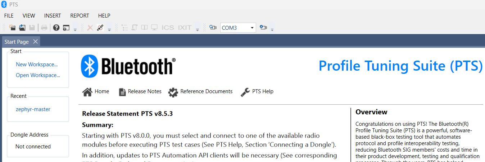
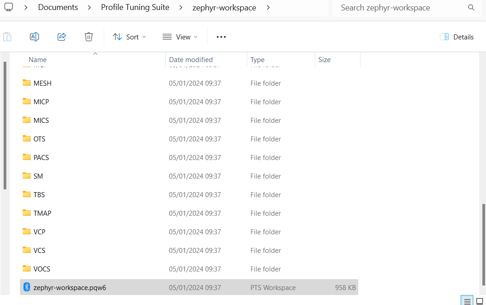

# Create PTS workspace

To create a PTS workspace (.pqw6 file) follow below steps:

[1. Create Launch Studio project](#create-launch-studio-project)

[2. Generate PTS workspace from ICSes](#generate-pts-workspace-from-icses)

## Create Launch Studio project

Log in to the https://www.bluetooth.com. Go to the My Blue -> My Test Plans.
The page will redirect you to Launch Studio. https://launchstudio.bluetooth.com.
In Getting Started tab, create a new project by clicking "Start the Bluetooth
Qualification Process with Required Testing". At Project Basics tab, fill the
required fields e.g.:

Save and continue to Layer Selection. Select as many layers/profiles as you know
that will be tested. If you are not sure, do not worry. The mandatory ones will
be marked by Consistency Checker, and the project can always be edited later
to add or remove profiles.

Save and continue to ICS Selection. On the left panel there are all the selected
profiles. Each profile has its own set of ICSes. The Consistency Checker has
selected automatically some of the mandatory ICSes. But some still have to be
selected manually, because of the multiple variants of some features.

Check which of the mandatory ICSes remain by clicking the Consistency Check:

To resolve all remaining mandatory ICSes it is convenient to follow and repeat
the below steps until the Consistency Check no longer displays missing dependencies:
- resolve manually ICSes of features with multiple variants,
- click on the Consistency Check to auto-select/recalculate remaining mandatory ICSes.

If you enable some optional ICSes, new mandatory ICSes to resolve may appear.
Remember to save the project from time to time, because any accidental tab refresh
will waste all your work.

After selecting all mandatory and optional ICSes, finally save and continue to
Testing tab. Here the project ICSes can be exported to a .pts file that will be
needed to generate a valid PTS workspace file.

## Generate PTS workspace from ICSes

Open PTS and go to Start -> New Workspace. The PTS may ask you to connect to
a PTS dongle first.

First step in the New Workspace creator is to select an IUT Device Address. You
may use here any address, even zeros, because with AutoPTS the IUT address will
be read from the IUT at runtime.

In the second step, fill all the fields and import ICSes from a .pts file exported
earlier from Launch Studio.

In the third step just proceed to Finish, because all test profiles have been already
selected at Import ICS.

Now your PTS workspace is ready to use.

Your workspace has been saved to a .pqw6 file. All other folders are just
a placeholders for logs and will be recreated by PTS each time the workspace is opened.

