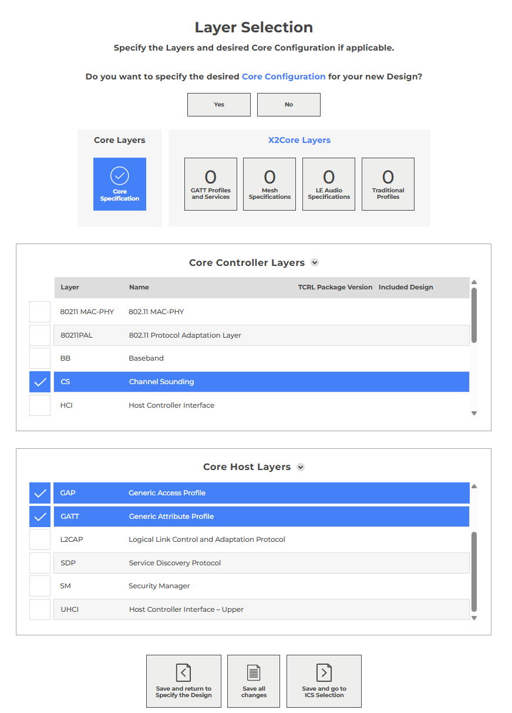
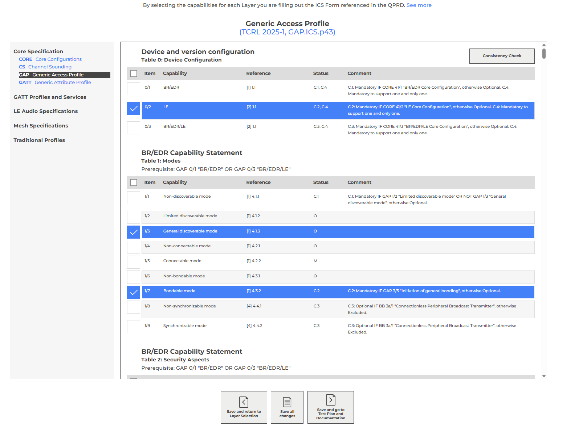

# Create PTS workspace

To create a PTS workspace (.pqw6 file) follow below steps:

[1. Qualification Workspace - Getting Started](#create-launch-studio-project)

[2. Generate PTS workspace from ICSes](#generate-pts-workspace-from-icses)

## Qualification Workspace - Getting Started

Log in to the https://www.bluetooth.com. Go to the My Blue -> Qualification Workspace.
The page will redirect you to Bluetooth Qualification Process. https://qualification.bluetooth.com/.
In Getting Started tab, create a new product by clicking "Start the Bluetooth
Qualification Process". 

On Product Details screen, the user defines a new Bluetooth project (Design) 
that will be part of the qualified product. 
In this step, it is possible to define the product name, description, 
model number, and publication date (either current or future). 
Additionally, a product website can be provided, and the visibility settings for 
other users can be configured.

It is possible to import several products by selecting the appropriate option "Import multiple Products"
or add individual Product.
To proceed to the next step you need to confirm the stage by selecting the "Save and go to Specify Design" button.

On Specify the Design screen is option of include any existing Design in Product.

By selecting the "Yes, I do" option you can specify which DN or QDID can be used.

While by selecting the "No, I do not" option it is possible to choose the recommended TCRL 
and advanced settings. 
in the lower part of the view there is an option to import ICS 
"Import from a file" by indicating the appropriate file, or selecting the option 
"No, I'II do that myself" which gives the user the option to choose what will be 
included in ICS.

Proceeding further using the "Save and go to the Layer Selection" button will open the next step

On Layer Selection screen,
in the first option we can determine whether we want to 
specify the desired Core Configuration for the new Design.
- Option No - it only informs us about the need for further Core Configuration manual configuration.
- Option Yes - gives us the ability to automatically complete the Layer Selection by choosing the options that interest us.

"Save and go to ICS Selection" button allows us to move on to the next ICS selection view.

depending on the options we have selected in the "Layer Selection" view, 
the ICS view will allow us to add or remove the selected test

On ICS Selection screen, the user selects Bluetooth-specific Capabilities—in this case, 
“802.11 Protocol Adaptation Layer”—as part of the Implementation Conformance Statement (ICS). 
Each capability is assigned a status: Mandatory (M), Optional (O), or Conditional (C). 
Once the appropriate options are selected, a Consistency Check can be run
and the test plan or documentation can be continued.

To export an ICS .pts file that can be loaded into PTS, you need to expand the "Support Tools" submenu and select the "Export Draft" option.
It is also possible to export a Draft file.

The location of the submenu is shown in the screenshot below.

## Generate PTS workspace from ICSes

Open PTS and go to Start -> New Workspace. The PTS may ask you to connect to
a PTS dongle first.

First step in the New Workspace creator is to select an IUT Device Address. You
may use here any address, even zeros, because with AutoPTS the IUT address will
be read from the IUT at runtime.

In the second step, fill all the fields and import ICSes from a .pts file exported
earlier from Launch Studio.

In the third step just proceed to Finish, because all test profiles have been already
selected at Import ICS.

Now your PTS workspace is ready to use.

Your workspace has been saved to a .pqw6 file. All other folders are just
a placeholders for logs and will be recreated by PTS each time the workspace is opened.

